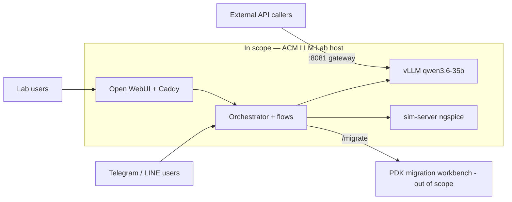

# 1. Objectives & Scope

> **System:** ACM LLM Lab (self-hosted LLM stack + "ACM Assistant" circuit-design orchestrator)
> **Author:** ACM Lab admin (duong.pt1771@) · **Date:** 2026-07-09 · **Version:** 0.1
> **Status:** Draft

## 1.1 Problem statement

Students and researchers in the ACM lab need help with **analog circuit design**:
theory questions, evaluation of SPICE netlists, and reading hand-drawn or
photographed schematics. Generic cloud chatbots hallucinate circuit measurements
and cannot run a real simulator; sending lab material to external providers is
also undesirable. The lab owns GPU hardware (2× RTX PRO 6000, 96 GB each) that
would otherwise sit idle.

The ACM LLM Lab stack solves this by self-hosting an LLM (vLLM, Qwen3.6-35B,
vision-capable) and wrapping it in a **deterministic orchestrator**: an LLM
routes each request into a fixed, code-defined flow that calls a real **ngspice
simulation server**, so every numeric claim about a circuit is backed by an
actual simulation, not model memory. The assistant is reachable through the
channels users already have (Open WebUI, Telegram, LINE), and the raw model is
additionally offered to trusted external parties via an authenticated
OpenAI-compatible gateway.

## 1.2 Goals / objectives

| # | Goal | Success metric | Priority |
|---|------|----------------|----------|
| G1 | Correct, simulation-backed circuit assessments (no hallucinated measurements) | Black-box eval suite ≥ 13/13 with zero fabricated metrics — **met 2026-07-04** (`tests/llm_eval/report.md`) | Must |
| G2 | Identical assistant behavior on every channel (WebUI / Telegram / LINE / API) | All channels converge on the same `POST /flow/*` API; reply language follows the user (EN/VI/ZH) | Must |
| G3 | Interactive latency acceptable for chat use | Flow p95 < 240 s (Prometheus alert `SlowFlows`); simple chat 10–30 s | Must |
| G4 | GPUs never usable anonymously | Unauthenticated endpoints (vLLM :8002, orchestrator :8100, LiteLLM :8003) unreachable from LAN/internet; external access only via authed Caddy gateway :8081 | Must |
| G5 | Operable by a single admin | Grafana dashboards + Prometheus alerts cover flows, LLM, GPU; runbook-level docs in `docs/` | Should |
| G6 | Serve external OpenAI-compatible API consumers | Gateway :8081 with shared Bearer key, reachable via campus LAN or Tailscale | Should |

## 1.3 Stakeholders

| Stakeholder | Role / interest in the system | Contact |
|-------------|-------------------------------|---------|
| Lab admin | Owner, operator, sole maintainer | duong.pt1771@gmail.com |
| Lab students / members | End users via Open WebUI, Telegram, LINE | — |
| External API consumers | Call the model via the :8081 gateway (key shared privately) | via admin |
| PDK-migration workbench owner | Provides the external `migrate_circuit` API (`MIGRATION_API_URL`) | TBD |
| OpenClaw partner | **Retired** — external sim node replaced by local sim-server on 2026-06-30 | — |

## 1.4 Scope

### In scope — the system WILL:

- Answer analog-circuit theory questions in the user's language (EN/VI/ZH).
- Evaluate SPICE netlists via real ngspice simulation, with charts (Bode, transient…).
- Transcribe schematic photos to netlists (vision) and evaluate them.
- Run an agentic tool-calling evaluation flow (`hermes_eval`).
- Hand off PDK-migration requests to the external migration workbench (`/migrate`).
- Serve the raw LLM to authorized external callers via the authed gateway.
- Provide web search to Open WebUI via a private SearXNG instance.
- Monitor itself (Grafana / Prometheus / Loki + alerts).

### Out of scope — the system will NOT:

- Train or fine-tune models (the `analog-llm` fine-tune is a **stopped spare**; GPU 1 fits only one model).
- Provide per-user billing / metered API keys (hardening Phase 4 — consciously not built).
- Provide high availability — single host, no failover; downtime is accepted.
- Implement the PDK-migration engine itself (external workbench, separate owner).
- Serve the general public — users are lab members and explicitly allowlisted externals.
- Guarantee data durability of chat history (lab tool, not a system of record).

### Scope boundary diagram

## 1.5 Assumptions & open questions

| # | Assumption / question | Impact if wrong | Owner | Status |
|---|-----------------------|-----------------|-------|--------|
| A1 | GPU 1 can only host one large model at a time (qwen3.6 **or** analog-llm) | Model switching stays manual/exclusive | admin | Resolved (confirmed; switch script removed 2026-07-04) |
| A2 | Netlists sent to the migration workbench (and its cloud LLM `gpt-5-mini`) are not confidential | Possible IP leak of lab designs to a cloud provider | admin | Open |
| A3 | Campus firewall keeps :8002/:8100/:8003 unreachable from outside; only :3000/:8081 exposed | Free anonymous GPU use if wrong | admin | Open — re-verify after any firewall change |
| A4 | What runs on GPU 0? (vLLM occupies GPU 1) | Capacity planning for a second model / embeddings | admin | Open |
| A5 | Telegram/LINE clients tolerate flows up to ~300 s | Longer flows get cut off client-side | admin | Resolved (known limit; see doc 06 B2) |

## 1.6 Success criteria for this analysis

All six documents filled from the running stack (not aspirations); every SPOF and
bottleneck mirrored into doc 06 with a proposed remediation; the security table in
doc 05 has no blank rows; open questions (A2–A4 above) have owners. Sign-off by
the lab admin using `checklist.md`.
