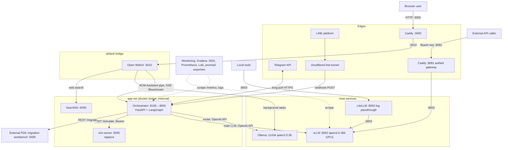

# 2. Components & Architecture

> **System:** ACM LLM Lab · **Date:** 2026-07-09 · **Version:** 0.1

## 2.1 Component inventory

### Hardware / infrastructure

| Component | Description | Location / host | Owner |
|-----------|-------------|-----------------|-------|
| GPU server | Single Linux host, 2× NVIDIA RTX PRO 6000 (96 GB each); GPU 1 runs vLLM, GPU 0 usage TBD (doc 01 A4) | Lab, campus LAN `140.113.28.150` | admin |
| HDD4 | Bulk storage for spare model weights (`analog-llm` Qwen2.5-32B fine-tune) | same host | admin |
| Campus network | NYCU LAN (`140.113.x`); firewall in front of the host | NYCU IT / admin | shared |
| Tailscale tailnet | Private overlay for off-campus access (`100.83.40.102`) | admin | admin |

### Software

| Component | Purpose | Technology / version | Repo / source |
|-----------|---------|----------------------|---------------|
| vLLM `qwen3.6-35b-a3b` | Main LLM: vision, reasoning, tool calling (`qwen3_xml` parser), 131k ctx, OpenAI-compatible, **no auth** | `vllm/vllm-openai` container, GPU 1, host `:8002` | manual `docker run` |
| Ollama `qwen2.5:3b-instruct` | Small/fast model: orchestrator intent router + Open WebUI background tasks | host systemd, `:11434` | host install |
| Orchestrator | FastAPI + LangGraph flow engine; hosts Telegram bot (long-poll) and LINE webhook in-process | container on `app-net`, `127.0.0.1`+`172.17.0.1` `:8100→8000` | `orchestrator/` |
| sim-server | Local ngspice circuit simulation (`POST /simulate`, Bearer auth) | container on `app-net`, `127.0.0.1:9000` | `sim-server/` |
| Open WebUI | Chat UI; "ACM Assistant" model = pipe to orchestrator | container, bridge net, `127.0.0.1:3010→8080` | manual `docker run` |
| Caddy `caddy-proxy` | `:3000` fronts Open WebUI; `:8081` authed LLM gateway (shared Bearer → vLLM) | host net | manual `docker run` |
| LiteLLM `litellm-proxy` | Unauthenticated **logging passthrough** to vLLM (`llm_traffic.jsonl`); not in orchestrator path | host net, `127.0.0.1:8003` only | manual `docker run` |
| line-tunnel | cloudflared tunnel delivering LINE webhooks to the orchestrator | container | `line-tunnel.sh` |
| SearXNG | Private meta-search backing Open WebUI web search | container on `app-net`, `127.0.0.1`+`172.17.0.1` `:5050` | `docker-compose.yml` |
| Monitoring stack | Grafana `:3001`, Prometheus, Loki, promtail, cAdvisor, node-exporter, nvidia-gpu-exporter | separate compose | `monitoring/` |
| `analog-llm` (spare) | **Stopped** Qwen2.5-32B analog fine-tune, port 8004; weights on HDD4 | not running | — |

### People / roles

| Role | Responsibility in the system | Headcount |
|------|------------------------------|-----------|
| Admin / operator / developer | Everything: deploys, secrets, monitoring, user support, key distribution | **1** (bus factor 1 — see doc 06) |
| Lab users | Chat via WebUI/Telegram/LINE | ~lab-sized, TBD |
| External API consumers | Call gateway :8081 with shared key | few, by invitation |

### Data assets

| Data asset | Description | Sensitivity | Where it lives |
|------------|-------------|-------------|----------------|
| Flow state / checkpoints | LangGraph SQLite checkpointer, threads DB, session memory (incl. recent user photos) | Internal / PII (user ids, photos) | `orchestrator/data/` → `/data` in container |
| Access log | One JSON record per flow (channel, user + Telegram username, request/answer text, durations, tokens) + per-LLM-call records | **Confidential** (full conversation text) | `/data/access.jsonl` + stdout→Loki |
| LLM traffic log | LiteLLM passthrough logs of local callers | Confidential | `litellm/logs/llm_traffic.jsonl` |
| Open WebUI data | Accounts, chat history | Confidential / PII | docker volume `open-webui` |
| Secrets | `.env` (bot tokens, sim key, hermes key…), Caddy gateway key `caddy/llm-gateway.key`, `docs/llm-api-key.secret.md` | **Secret** | host filesystem (see doc 05 §5.2 gaps) |
| Model weights | qwen3.6-35b FP8; analog-llm spare | Internal | host disk / HDD4 |
| Monitoring data | Prometheus TSDB, Loki logs, Grafana dashboards | Internal | `monitoring/` volumes |

### Processes / procedures

| Process | Trigger | Manual or automated |
|---------|---------|---------------------|
| Deploy orchestrator + sim-server | code change | Manual: `docker compose -f docker-compose.orchestrator.yml up -d --build` |
| Deploy SearXNG | config change | Manual: `docker compose up -d searxng` |
| (Re)start vLLM / Open WebUI / Caddy / LiteLLM / tunnel | host reboot, model change | **Manual `docker run`** (restart policies only; not compose-managed) |
| API-key distribution / tailnet approval | new external consumer | Manual by admin |
| Model switch (qwen3.6 ↔ analog-llm) | research need | Manual (switch script deleted 2026-07-04; exclusive on GPU 1) |
| Backups | — | **None known — TBD** (doc 06 F-gap) |

## 2.2 Architecture overview

**Architecture style:** hub-and-spoke services on one host — a central FastAPI
orchestrator (router + deterministic LangGraph flows + HITL interrupts) in front of
self-hosted model servers, with reverse-proxy edges for humans (Caddy :3000) and
machines (Caddy :8081).

**Why this style?** Business flows are fixed and known, so flow logic lives in
code (deterministic, testable) and the LLM is used only for intent routing,
parameter extraction, and natural-language explanation. LangGraph was chosen for
its built-in durable pause/resume (`interrupt()` + persistent checkpointer),
needed because flows can wait on human verification. Everything is on one host
because that is where the GPUs are; several containers pre-date compose adoption
and still run via `docker run` (historical, acknowledged in `docker-compose.yml`).

### Architecture diagram

## 2.3 Component interaction matrix

| From | To | Protocol / mechanism | Sync/Async | Notes |
|------|----|----------------------|------------|-------|
| Browser | Caddy :3000 → Open WebUI | HTTP | sync | UI entry point (LAN/Tailscale) |
| Open WebUI pipe | Orchestrator | `POST /flow/stream` (SSE) via `host.docker.internal:8100` | streaming | pipe v0.4.0, async generator |
| Telegram bot (in-process) | Telegram API | HTTPS long-poll, outbound only | async | no inbound port needed |
| LINE platform | Orchestrator `/line/webhook` | HTTPS via cloudflared tunnel | async | signature-checked (channel secret) |
| Orchestrator | Ollama | OpenAI-compatible REST :11434 | sync | intent router; falls back to main LLM if down |
| Orchestrator | vLLM | OpenAI-compatible REST :8002 (direct) | sync/stream | main answers, vision, tool calling |
| Orchestrator | sim-server | `POST /simulate`, Bearer `SIM_API_KEY` | sync, 180 s timeout, 1 retry | contract: `sim-api.openapi.yaml` |
| Orchestrator | Migration workbench | REST `MIGRATION_API_URL` (:5000) | sync | dry-run default; uses cloud LLM `gpt-5-mini` on their side |
| Open WebUI | Ollama | OpenAI-compatible REST | sync | title/tags/follow-ups only |
| Open WebUI | SearXNG | HTTP :5050 via `host.docker.internal` | sync | web search |
| External caller | Caddy :8081 → vLLM | OpenAI API + shared Bearer | sync/stream | only sanctioned external model path |
| Local tools | LiteLLM :8003 → vLLM | OpenAI API, no auth (loopback only) | sync | traffic logging side-channel |
| Prometheus | Orchestrator `/metrics`, vLLM :8002, exporters | HTTP scrape | async | `acm_*` metrics; alerts in `alerts.yml` |
| promtail | container stdout → Loki | log shipping | async | `flow` / `llm_call` JSON records |

## 2.4 Deployment view

| Component | Runs on | Environment(s) | Deployment method |
|-----------|---------|----------------|-------------------|
| Orchestrator, sim-server | containers, `app-net` | prod (single env) | `docker-compose.orchestrator.yml` |
| SearXNG | container, `app-net` | prod | `docker-compose.yml` |
| vLLM, Open WebUI, Caddy, LiteLLM, line-tunnel | containers | prod | **manual `docker run`** — do NOT `docker compose down` |
| Ollama | host process | prod | systemd |
| Monitoring stack | containers | prod | `monitoring/docker-compose.monitoring.yml` |
| analog-llm | — | stopped spare | manual, weights on HDD4 |

There is **no dev/staging environment**; changes go straight to the live stack
(eval suite in `tests/llm_eval/` is the safety net).

## 2.5 Dependencies

| Dependency | Type | Version pinned? | What breaks without it |
|------------|------|-----------------|------------------------|
| vLLM image + Qwen3.6-35B-A3B-FP8 weights | infra/model | image tag TBD; weights local | everything LLM: all flows, gateway |
| LangGraph + FastAPI (orchestrator `requirements`) | library | see `orchestrator/` | flow engine |
| ngspice (in sim-server image) | binary | image-pinned (was ngspice-36 on OpenClaw) | `evaluate_circuit`, `hermes_eval` sims |
| Ollama + qwen2.5:3b-instruct | service | host version TBD | intent routing degrades (fallback → main LLM, slower) |
| Telegram Bot API | external service | n/a | Telegram channel |
| LINE Messaging API + Cloudflare tunnel | external service | n/a | LINE channel |
| Tailscale | external service | n/a | off-campus access |
| Migration workbench (+ its `gpt-5-mini`) | external service | n/a | `migrate_circuit` flow only |
| Docker + `app-net` external network | infra | n/a | container stack won't start (`docker network create app-net`) |
| NVIDIA driver / CUDA | infra | host | vLLM won't start |
