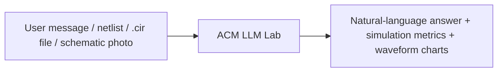
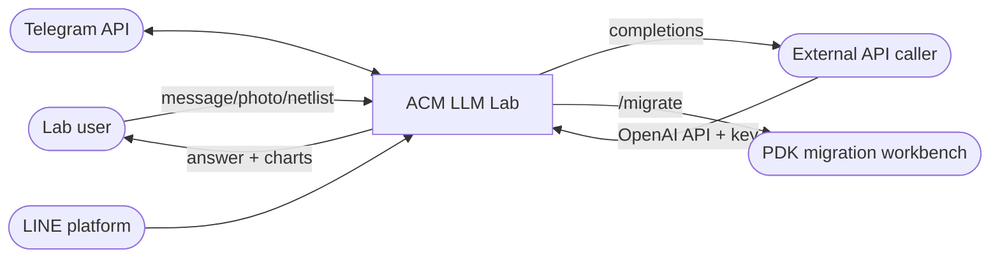
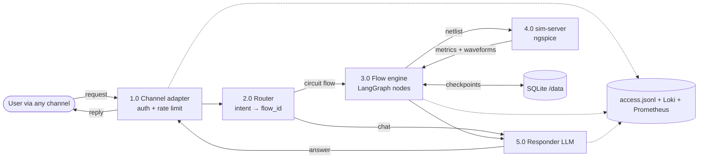
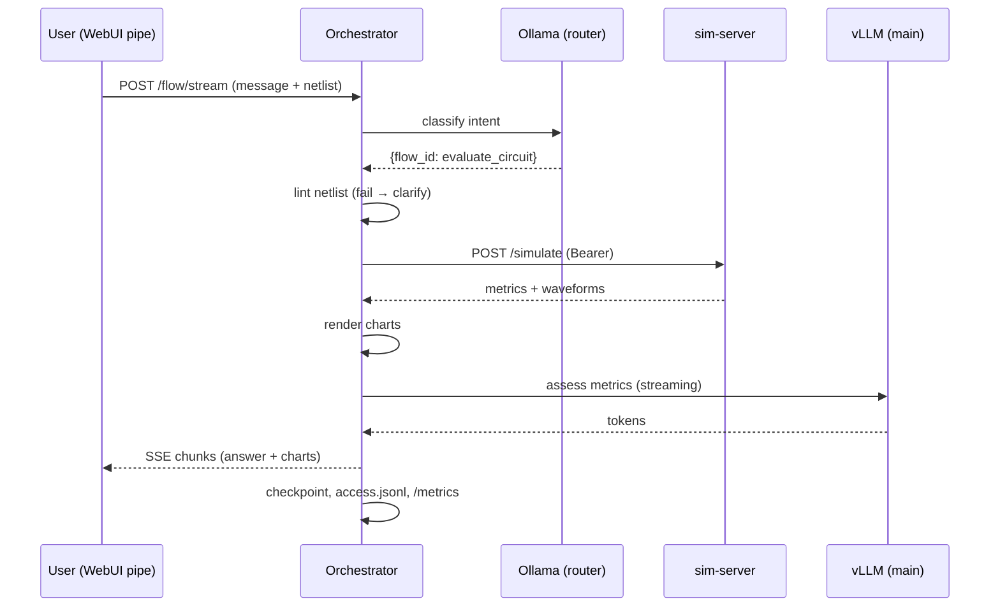
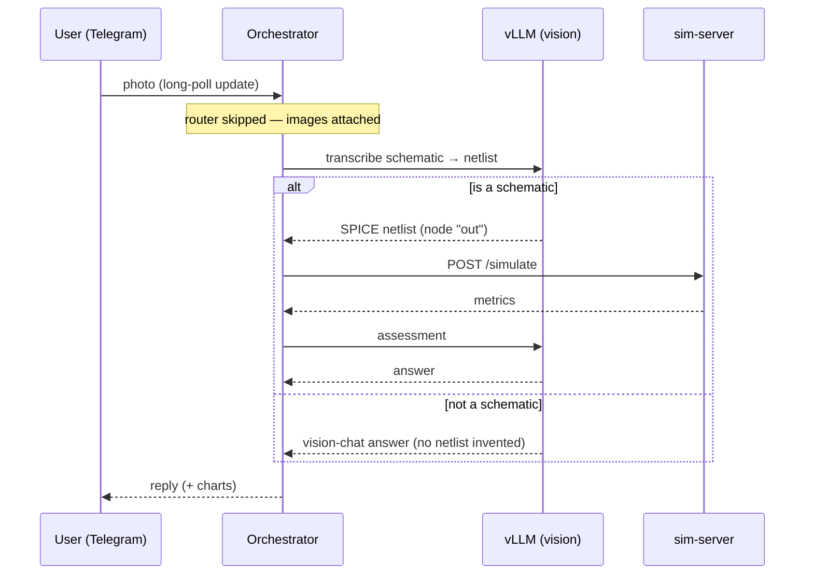

# 3. Data Flow & Processes

> **System:** ACM LLM Lab · **Date:** 2026-07-09 · **Version:** 0.1

## 3.1 Black-box view

### Inputs

| # | Input | Source | Format / protocol | Frequency / volume |
|---|-------|--------|-------------------|--------------------|
| I1 | Chat message (EN/VI/ZH), optionally with netlist text | user via Open WebUI / Telegram / LINE / API | text over SSE, long-poll, webhook, REST | interactive; lab-scale (≤ a few req/min, cap 3 concurrent flows) |
| I2 | `.cir` netlist file attachment | user | SPICE netlist (UTF-8) | occasional |
| I3 | Schematic photo | user (Telegram/LINE/WebUI upload) | JPEG/PNG | occasional |
| I4 | `/migrate` command + design | user | text/file | rare |
| I5 | Raw OpenAI-compatible API calls | external consumers | HTTPS + Bearer via gateway :8081 | external-party dependent |
| I6 | Web-search queries | Open WebUI feature | HTTP to SearXNG | per user action |

### Outputs

| # | Output | Destination | Format / protocol | Trigger |
|---|--------|-------------|-------------------|---------|
| O1 | Streamed assistant answer | Open WebUI | SSE chunks (`/flow/stream`) | every WebUI request |
| O2 | Answer message (+ chart images) | Telegram / LINE user | bot API messages | flow completion |
| O3 | Simulation metrics + Bode/transient charts | user (embedded in O1/O2) | numbers + PNG charts | circuit flows |
| O4 | Clarify / verification prompt | user | message; flow paused via `interrupt()` | missing params or HITL step |
| O5 | Model completion | external API caller | OpenAI API response/stream | gateway request |
| O6 | Metrics / logs | Prometheus, Loki, `/data/access.jsonl` | Prometheus exposition, JSON records | continuous |

## 3.2 White-box view: processing

### Processing steps (main circuit flow)

| # | Step | Input → Output | Business rules applied | Component (doc 02) |
|---|------|----------------|------------------------|--------------------|
| P1 | Channel adapter normalizes request | channel event → `/flow/start` or `/flow/stream` call | BR5, BR6 (rate limits, allowlists) | orchestrator adapters (`telegram_bot.py`, `line_webhook.py`, WebUI pipe) |
| P2 | Intent routing | message → `{flow_id, params}` | BR1; skipped when `flow_id` forced or images attached | Router (`app/router.py`) on Ollama 3b, fallback vLLM |
| P3 | Vision transcription (if photo) | image → SPICE netlist (or vision-chat answer if not a schematic) | BR3 (output node named `out`) | `app/vision.py` + vLLM vision |
| P4 | Lint netlist | netlist → validated netlist / clarify | BR2 | flow node (moved before model call in the 2026-06-15 latency fix) |
| P5 | Simulate | netlist → metrics + decimated waveforms | sim contract (`sim-api.openapi.yaml`); `max_runtime_s` clamp [1,170] | sim-server (ngspice) |
| P6 | Charts | waveforms → PNG charts | — | `app/tools/charts.py` |
| P7 | LLM assessment | metrics + question → natural-language answer | BR4 (reply language) | vLLM qwen3.6 |
| P8 | Persist + account | flow result → checkpoint, access log, metrics | — | SQLite `/data`, `access_log.py`, `metrics.py` |

### Business rules

| Rule ID | Rule | Where enforced | Source of truth |
|---------|------|----------------|-----------------|
| BR1 | LLM decides only *which* flow + params; flow shape is code. `flow_id="chat"` short-circuits to plain LLM answer | router + `FLOWS` registry | `orchestrator.md` §3 |
| BR2 | Missing/ambiguous params → `MissingParams` → **clarify** response, never guess | flow `prepare()` | `orchestrator.md` §4.1 |
| BR3 | Automatic AC/DC/tran metrics assume output node literally named `out`; prompts enforce renaming | flow prompts + sim-server | `sim-api-spec.md` §2 |
| BR4 | Reply in the user's language (EN/VI/ZH), default EN; code/docs stay EN | responder prompts | language policy |
| BR5 | Per-chat serialization + rate limit (5 msg / 60 s default) on Telegram/LINE; allowlists (`*_ALLOWED_*`, empty = open) | channel adapters | `hardening-plan.md` Phase 1 |
| BR6 | Global cap `MAX_CONCURRENT_FLOWS=3`; excess → localized `busy` + `acm_flows_rejected_total` | `main.py` | `hardening-plan.md` Phase 1 |
| BR7 | Vision path bypasses the router when images are attached; non-schematic images get a vision-chat answer, never an invented netlist | vision path | `architecture.md` §3, eval V5 |
| BR8 | Migration runs `MIGRATION_DRY_RUN=true` by default | env / migrate flow | compose file |

## 3.3 Data flow diagrams

### Level 0 (context)

### Level 1 (major subsystems)

### Key sequence diagrams

**`evaluate_circuit` (text netlist):**

**Schematic photo (vision path):**

## 3.4 Storage

| Store | Type | What is stored | Structure / schema ref | Retention | Backup? |
|-------|------|----------------|------------------------|-----------|---------|
| `/data` (orchestrator volume) | SQLite files | LangGraph checkpoints, threads.db, session memory (incl. recent user photos, since 2026-07-06) | `orchestrator.md` | unbounded — no TTL yet (stuck `running` threads are known debt) | **N — none** |
| `/data/access.jsonl` | append-only JSONL | `flow` + `llm_call` records (full request/answer text, tokens, timings) | `orchestrator.md` §11 | unbounded | N (duplicated to Loki) |
| `open-webui` docker volume | app DB | accounts, chat history | Open WebUI internal | app-managed | **N** |
| `litellm/logs/llm_traffic.jsonl` | JSONL | passthrough LLM traffic | custom_logger | unbounded | N |
| Prometheus TSDB / Loki | TSDB / log store | metrics, logs | monitoring compose | Prometheus/Loki defaults (TBD) | N |
| Docker json-file logs | files | container stdout | 10 × 20 MB (SearXNG; others TBD) | rotated | n/a |
| Model weights | files | qwen3.6 FP8; analog-llm spare | — | permanent | re-downloadable / HDD4 copy |

### Data lifecycle

User request text and photos are created at the channel edge (Telegram/LINE
servers → **trust boundary** → orchestrator), persisted into checkpoints,
session memory, and `access.jsonl`, and copied into Loki via stdout. Nothing is
ever archived or deleted — every store grows unbounded, and none is backed up
(doc 06 F2, F3). Netlists sent to `/migrate` cross a second trust boundary to
the external workbench and its cloud LLM (doc 01 A2).

## 3.5 Error and edge-case flows

| Scenario | Current behavior | Desired behavior | Gap? |
|----------|------------------|------------------|------|
| Malformed netlist (missing `.end`, wrong node name) | Lint/flow catches it; assistant explains the defect and gives hand-calculated values clearly labeled (eval B3) | same | No |
| Non-schematic photo | Vision path answers as image chat; no netlist invented (eval V5) | same | No |
| Router (Ollama) unreachable | Falls back to main LLM for routing | same (slower, acceptable) | No |
| sim-server timeout / error | Adapter timeout 180 s, 1 retry, mapped error to user | same | No |
| Flow over global cap | Localized `busy` reply, counted in `acm_flows_rejected_total` | optional: queue instead of reject | Minor |
| Client disconnects mid-flow | Thread stuck in status `running` in threads.db | TTL/cleanup job (`orchestrator.md` §14) | **Yes — known debt** |
| Flow exceeds ~300 s on Telegram | Telegram client-side cap cuts the reply | bot `wait:false` + polling | **Yes — known debt** |
| Ambiguous request / missing params | Clarify response (BR2) | same | No |
| Host reboot | compose services restart; **manually-run containers** rely on `docker run --restart` flags — unverified | all services come back unattended | **TBD — verify** |
