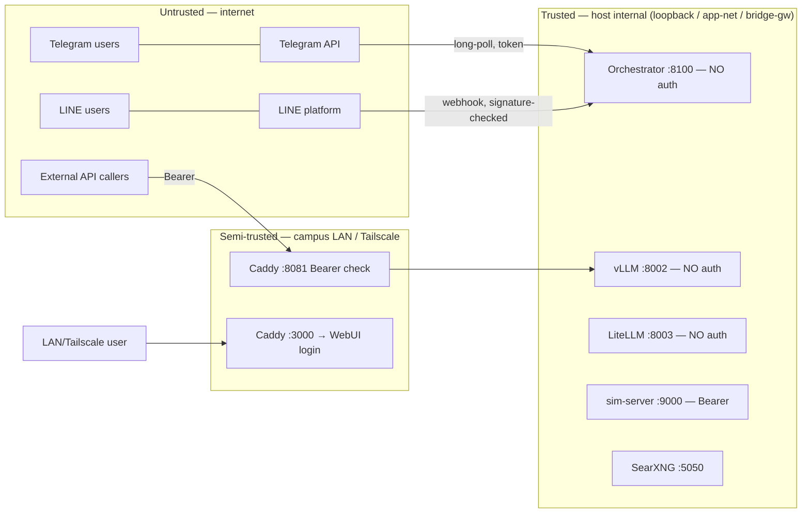

# 4. Boundaries & Interfaces

> **System:** ACM LLM Lab · **Date:** 2026-07-09 · **Version:** 0.1

## 4.1 User interfaces (human ↔ system)

| Interface | User type | Channel | Main tasks performed |
|-----------|-----------|---------|----------------------|
| Open WebUI ("ACM Assistant" model) | lab user | web (Caddy :3000, LAN/Tailscale) | chat, netlist eval, photo upload, web search; auto-routes to the single assistant model since 2026-06-12 |
| Telegram bot | lab user | Telegram app | same flows on mobile; `/cancel`; reply-to-photo follow-ups |
| LINE bot | lab user | LINE app | same flows; allowlist + rate limit |
| OpenAI-compatible API | external developer | HTTP :8081 (LAN `140.113.28.150` / Tailscale `100.83.40.102`) | raw model calls from their own tools |
| Grafana | admin | web :3001 | dashboards `ACM Orchestrator`, GPU, logs |
| Host shell / compose | admin | SSH/CLI | deploys, restarts, key management |

### UX assessment

| Interface | Friction / issue | Severity | Suggested improvement |
|-----------|------------------|----------|------------------------|
| Telegram | Flows > ~300 s get cut off by the client-side cap (long `hermes_eval`) | Med | switch bot to `wait:false` + poll for result |
| Telegram/LINE | Second message while a flow runs → "still working" rejection (per-chat serialization) | Low | acceptable by design; message is localized |
| Open WebUI | Long non-streamed waits fixed 2026-06-15 (385 s flow → lint-first + streaming); streaming now default | Low (resolved) | — |
| All channels | `busy` reply when 3 flows already in flight | Low | queue with position feedback instead of reject |
| External API | Key is a single **shared** Bearer for all consumers — no per-user revocation | Med | per-key auth (LiteLLM virtual keys, hardening Phase 4) |

## 4.2 System integrations (system ↔ system)

| # | External system | Direction | Mechanism | Data exchanged | Auth method | Contract / spec |
|---|-----------------|-----------|-----------|----------------|-------------|-----------------|
| X1 | Telegram Bot API | both (outbound long-poll) | HTTPS REST | messages, photos, chart images | bot token (`.env`) | Telegram Bot API docs |
| X2 | LINE Messaging API | both (inbound via tunnel) | HTTPS webhook + reply API | messages, photos, replies | channel secret (signature) + access token | LINE docs |
| X3 | Cloudflare tunnel | in | cloudflared → orchestrator | LINE webhook traffic | tunnel credentials | `line-tunnel.sh` |
| X4 | sim-server (internal but contract-first) | out | `POST /simulate` | netlist → metrics + waveforms | Bearer `SIM_API_KEY` | `orchestrator/sim-api.openapi.yaml` (source of truth) |
| X5 | PDK migration workbench | out | REST `MIGRATION_API_URL` (:5000) | circuit design, migration params | TBD — verify | mock: `tests/llm_eval/mock_migration_api.py` |
| X6 | Tailscale | in | overlay network | all remote access | tailnet device approval by admin | `remote-access.md` |
| X7 | External API consumers | in | Caddy :8081 → vLLM | prompts/completions | shared Bearer key (`caddy/llm-gateway.key`) | `llm-api-access.md` |
| X8 | Upstream web (via SearXNG) | out | meta-search HTTP | search queries/results | none | SearXNG config |
| X9 | ~~OpenClaw sim node~~ | — | — | **retired 2026-06-30**, replaced by local sim-server; old shared key should be rotated/void | — | `sim-api-spec.md` history |

### Interface contracts

- **Sim API** is the one formally specified contract
  (`sim-api.openapi.yaml`); the orchestrator-side client is fixed, and any
  compliant server can be swapped in via `SIM_API_URL`. Two contract mismatches
  found against real traffic were fixed 2026-06-12 — the spec has been
  live-verified, not just documented. Unknown `options` keys must be ignored;
  `max_runtime_s` clamps to [1, 170].
- **LLM gateway** speaks the standard OpenAI API; model `qwen3.6-35b-a3b`.
- **Migration API** contract exists as a mock in the eval suite; the real
  workbench's error codes and auth are **TBD — verify against real traffic**.
- Channel contracts (Telegram/LINE) are vendor-defined; the LINE webhook was
  contract-verified end-to-end when the tunnel went live.

## 4.3 Boundary definition & ownership

| Boundary point | Our side owns | Their side owns | Responsible on failure | SLA / expectation |
|----------------|---------------|-----------------|------------------------|--------------------|
| Caddy :8081 gateway | key checking, forwarding, uptime | consumer's client config, key secrecy | admin (uptime), consumer (leaked key → admin rotates) | best-effort |
| Telegram / LINE APIs | bot logic, token secrecy | message delivery | vendor outage: wait; token leak: admin | vendor SLA |
| cloudflared tunnel | tunnel container | Cloudflare edge | admin restarts container | best-effort |
| Migration workbench | request formatting, dry-run default | migration results, their cloud LLM usage | workbench owner (results), admin (transport) | **TBD — no named contact (doc 06)** |
| Tailscale tailnet | device approvals | overlay availability | admin approves; vendor outage: use campus LAN | vendor SLA |
| Campus firewall | correct port bindings on host | perimeter filtering | NYCU IT / admin jointly | assumption A3 — re-verify after changes |

### Trust boundaries

Crossings and their validation:

| Crossing | Validation / auth | Status |
|----------|-------------------|--------|
| Internet → orchestrator via Telegram | bot token + `TELEGRAM_ALLOWED_CHAT_IDS` + rate limit | OK (allowlist empty = open — set it) |
| Internet → orchestrator via LINE | signature check + `LINE_ALLOWED_USER_IDS` + rate limit | OK |
| LAN/Tailscale → WebUI | Open WebUI account login | OK |
| LAN/Tailscale → :8081 | shared Bearer key | OK but single shared key (F5) |
| LAN → :8002/:8100/:8003 | **none** — protected only by loopback/bridge-gw port bindings + firewall | Flagged: binding-based, no defense in depth (F4) |
| Orchestrator → migration workbench (+ cloud LLM) | outbound; data leaves the trust domain | **Flagged — doc 01 A2** |

## 4.4 Failure modes at the boundary

| Integration | If it's down / slow | Detection | Fallback behavior |
|-------------|---------------------|-----------|-------------------|
| Telegram API | bot silent; flows unaffected for other channels | none automated (TBD) | wait for vendor; long-poll reconnects |
| LINE / cloudflared | LINE webhooks lost | none automated (TBD) | restart tunnel container |
| Ollama (router) | routing slower | logs | **automatic fallback to main LLM** |
| vLLM | all flows + gateway fail | Prometheus vLLM scrape, Grafana, `acm_llm_calls_total{ok="false"}` | none — SPOF (doc 06 S1) |
| sim-server | circuit flows fail after 180 s timeout + 1 retry | flow failure metrics, `FlowFailures` alert | error surfaced to user; chat flows unaffected |
| Migration workbench | `migrate_circuit` fails | flow failure | error to user; dry-run default limits damage |
| SearXNG | WebUI web search fails | user-visible | feature degrades; chat unaffected |
| Tailscale | off-campus access lost | user reports | campus LAN still works |
